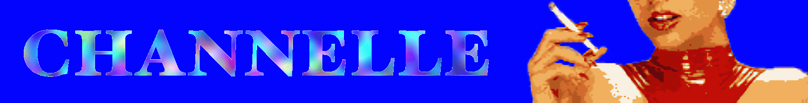

# Skärmteaterns Channelle

A useful and open source video conference tool to replace Zoom, Microsoft Teams etc suitable for digital theater acts, holding lectures, talks etc. The Swedish theater group Skärmteatern's online venue when performing online. https://channelle.freaks.se/

Channelle consists of two individual parts - The **Stage** is a server/client webapplication responsible for a single performance or lecture, i.e. a single online meeting in a conference tool. The **Theater House** is a planing and scheduling webapplication primary meant to create and launch scenes.

## Stage Server / Client

_**Found in this repo**_ - TODO: Details to be added here.

#### Requirements

 - Node.JS version 21 or higher.
 - Python version 3.7 or higher and PIP3, used by media  soupt

#### Used libraries

The Scene Server makes heavy use of **[Media Soup](https://mediasoup.org/)** for multimedia processing and communcation. It enables Real-time Transport (RTP) Media Streaming with a focus on few to many (one to many) broadcasting and group video conferencing

Additionally used libraries for reference

 - [Prisma ORM](https://www.prisma.io/orm)
 - [Bulma](https://bulma.io/)

## Theater House Server / Client

*yet to be implemented*

## Planing and contributions

Right now we are working towards version 1.0 - want to contribute? Get in touch! 

## History

Skärmteatern is the creation of two swedish performence artists that, during the COVID pandemic started performing live theater online using Zoom meetings. To great success they were later granted a culture grant by the Swedish state to help continue this and develop an online application able to better serve as a theater scene and that would be free from the economic interessts of any huge international cooperation.

## Licence

<a property="dct:title" rel="cc:attributionURL" href="https://codeberg.org/lyret/channelle">Channelle</a> by <a rel="cc:attributionURL dct:creator" property="cc:attributionName" href="">Skärmteatern</a> & <a rel="cc:attributionURL dct:creator" property="cc:attributionName" href="https://maskinrepubliken.se/">Maskinrepubliken</a> is licensed under <a href="https://creativecommons.org/licenses/by-nc/4.0/?ref=chooser-v1" target="_blank" rel="license noopener noreferrer" style="display:inline-block;">CC BY-NC 4.0</a>

See [LICENSE](LICENSE.md)

